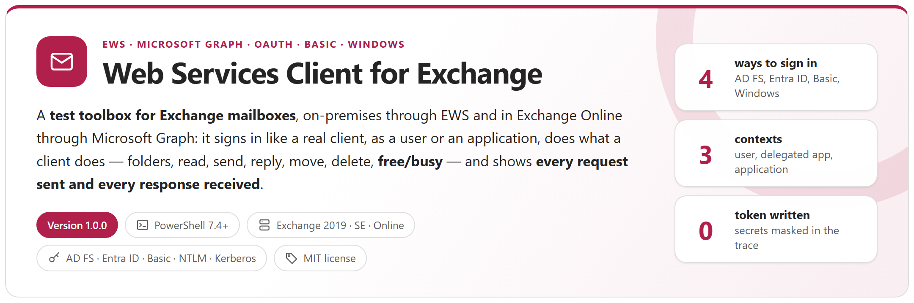
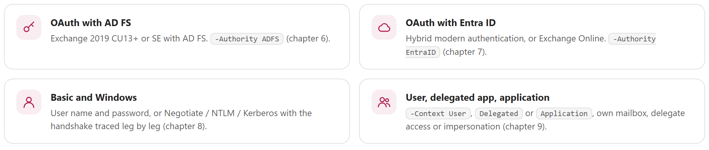
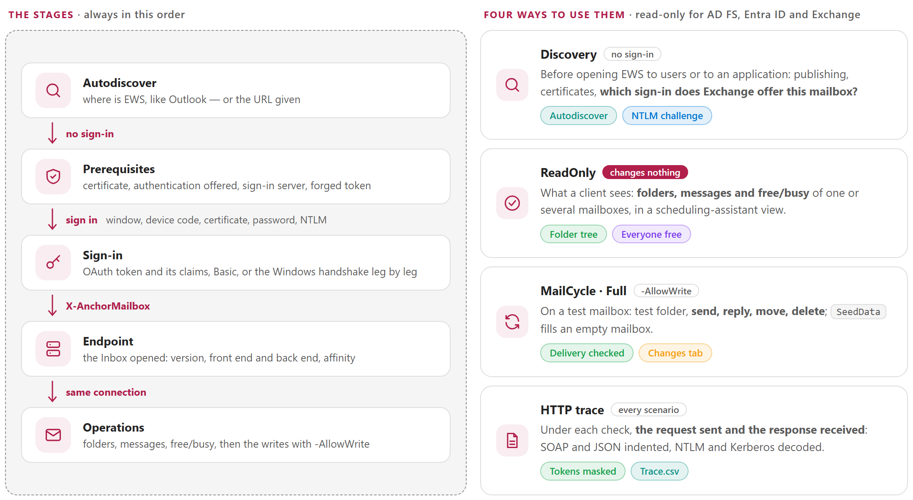
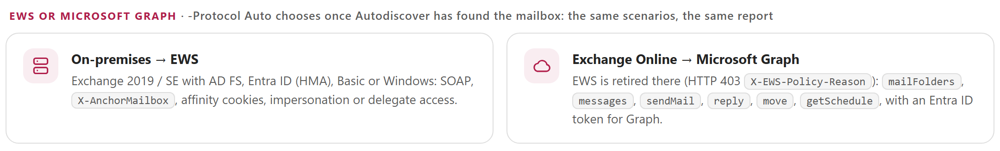
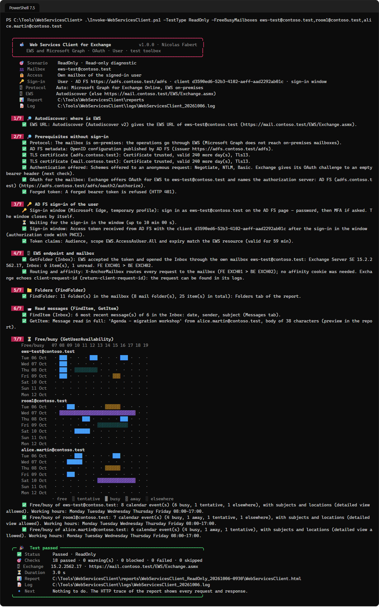
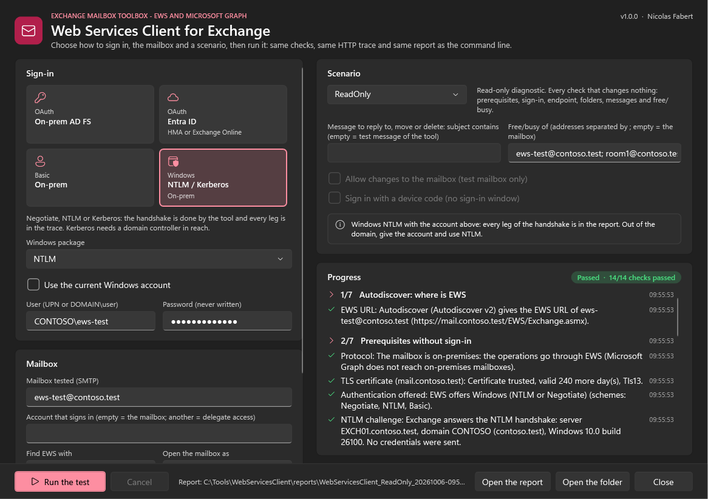

<p align="center">
  <picture>
    <source media="(prefers-color-scheme: dark)" srcset="package/docs/images/readme-banner-dark.png">
    
  </picture>
</p>

<p align="center">
  <a href="#why"><b>Why</b></a> &nbsp;&middot;&nbsp;
  <a href="#how-it-works"><b>How it works</b></a> &nbsp;&middot;&nbsp;
  <a href="#ews-or-microsoft-graph"><b>EWS or Graph</b></a> &nbsp;&middot;&nbsp;
  <a href="#reports"><b>Reports</b></a> &nbsp;&middot;&nbsp;
  <a href="#quick-start"><b>Quick start</b></a> &nbsp;&middot;&nbsp;
  <a href="package/docs/WebServicesClient-UserGuide.md"><b>User guide</b></a> &nbsp;&middot;&nbsp;
  <a href="package/docs/WebServicesClient-Guide.md"><b>Developer guide</b></a>
</p>

> [!IMPORTANT]
> Files downloaded from the Internet may be blocked by Windows and fail to run. Before using this project, unblock every file in the downloaded folder:
>
> ```powershell
> Get-ChildItem "C:\Chemin\Du\Dossier" -Recurse -File -Force | Unblock-File
> ```
>
> Replace the example path with the folder where you downloaded or extracted this project.

## Why

An application or a user that cannot reach a mailbox through EWS says almost nothing: *401*, *cannot connect*, a password prompt. Yet the path crosses many parts that each fail in their own way: Autodiscover, the HTTPS publishing and its reverse proxy, the authorization server (AD FS, or Entra ID and Conditional Access), the token — its audience and its permission —, the authentication policy of the user, the EWS access policies, the routing from the front end to the back end, the permissions on the mailbox, throttling. And in Exchange Online, EWS itself is being retired.

This tool replays that path from an administration workstation — in the domain or not —, **stage by stage**, with the four ways a client signs in and the three contexts an application runs in, and says for each check what works, what does not, and what to look at, with **the request it sent and the response it received**. It replaces a single free/busy script with a complete client: folders, read, send, reply, move, delete and free/busy of several mailboxes.

<picture>
  <source media="(prefers-color-scheme: dark)" srcset="package/docs/images/readme-principles-dark.png">
  
</picture>

## How it works

<picture>
  <source media="(prefers-color-scheme: dark)" srcset="package/docs/images/readme-how-it-works-dark.png">
  
</picture>

- **Finds EWS like Outlook**: Autodiscover v2, then the classic POX Autodiscover with a password, the HTTP redirect and the SRV record — or a URL given (`-Discovery Manual`).
- **Before any sign-in** (`Discovery`): TLS certificates, the authentication EWS offers, AD FS metadata or the Entra ID tenant, **which sign-in Exchange offers this mailbox**, a forged token that must be refused, the NTLM challenge (server, AD domain) and the Kerberos realm.
- **Signs in like a client**: a sign-in window (Microsoft Edge or Google Chrome, temporary profile) for the password and the MFA, or a device code; a certificate or a secret for an application; a password for Basic; the Windows handshake done by the tool, **leg by leg, with the channel binding** of Extended Protection — so NTLM also works from a computer outside the domain and behind a reverse proxy.
- **Behaves like a good EWS client**: `X-AnchorMailbox`, server affinity and its cookies, `client-request-id`, `RequestServerVersion`, impersonation or delegate access, throttling (`ErrorServerBusy`, `429`, `503`) waited out.
- **Safe on a production organisation**: nothing is written without `-AllowWrite`; reply, move and delete act only on the message named, or on the test message the tool sent; nothing is changed in AD FS, Entra ID or Exchange. Tokens, secrets and passwords are never written.

## EWS or Microsoft Graph

<picture>
  <source media="(prefers-color-scheme: dark)" srcset="package/docs/images/readme-protocols-dark.png">
  
</picture>

EWS is disabled in Exchange Online from October 2026 and stopped in April 2027, and Microsoft Graph does not reach on-premises mailboxes. With `-Protocol Auto` (default), the tool uses EWS for an on-premises mailbox and Microsoft Graph for a mailbox in Exchange Online — the same scenarios, the same checks and the same report. `-Protocol EWS` shows the refusal of Exchange Online (`HTTP 403`, `X-EWS-Policy-Reason`).

## Reports

<table>
  <tr>
    <td width="50%" valign="top"><a href="package/docs/images/wsc-report-overview.png"></a><br><sub><b>HTML report</b> &middot; result, checks passed, EWS requests, changes, and what was tested: mailbox, sign-in, token, EWS URL, servers and affinity</sub></td>
    <td width="50%" valign="top"><a href="package/docs/images/wsc-report-freebusy.png"></a><br><sub><b>Free/busy</b> &middot; like the scheduling assistant of Outlook: one row per mailbox, working hours, and when everyone is free</sub></td>
  </tr>
  <tr>
    <td width="50%" valign="top"><a href="package/docs/images/wsc-report-exchange.png"></a><br><sub><b>Request sent, response received</b> &middot; for every check: headers, SOAP and JSON indented, NTLM and Kerberos decoded; tokens masked</sub></td>
    <td width="50%" valign="top"><a href="package/docs/images/wsc-report-folders.png"></a><br><sub><b>Folders</b> &middot; the real names as a tree; the tabs Messages, Free/busy, Changes and HTTP trace next to it</sub></td>
  </tr>
  <tr>
    <td width="50%" valign="top"><a href="package/docs/images/wsc-console.png"></a><br><sub><b>Console</b> &middot; a ReadOnly run with AD FS, from Autodiscover to the free/busy map of three mailboxes</sub></td>
    <td width="50%" valign="top"><a href="package/docs/images/wsc-gui-dark.png"></a><br><sub><b>Window</b> &middot; choose the sign-in method, the mailbox and the scenario, follow the progress, open the report</sub></td>
  </tr>
</table>

Each run writes `Steps.csv` (one row per check), `Trace.csv` (every HTTP request and response), `Folders.csv`, `Messages.csv` (headers only), `FreeBusy.csv`, `Actions.csv` (what the run changed), `Summary.json` and a self-contained HTML report.

## Requirements

| Item | Requirement |
|---|---|
| Workstation | Windows 10 / 11 or Windows Server 2016 to 2025, **PowerShell 7.4** or later (7.5 or later for the Windows 11 look of the window). Nothing to install; in the domain or not. |
| Browser | Microsoft Edge or Google Chrome, for the OAuth sign-in window. Without one, a device code is shown instead. |
| Network | HTTPS to EWS (or `graph.microsoft.com`), to Autodiscover, and to AD FS or `login.microsoftonline.com`. Kerberos also needs a domain controller in reach. |
| Account | A **test mailbox** and its password (and its MFA) for the scenarios that write. An application needs its app registration and an admin consent. |
| Exchange | Exchange Server 2019 CU13+ or SE with OAuth through AD FS; Exchange on-premises in hybrid with HMA; Exchange Online; or Basic / Windows authentication on the EWS virtual directory. |

## Quick start

```powershell
git clone https://github.com/Nico77600/WebServicesClient.git
cd WebServicesClient\package
notepad .\config\WebServicesClient.config.psd1     # the test mailbox, the EWS URL, the AD FS URL

.\Invoke-WebServicesClient.ps1 -TestType Discovery                                   # no sign-in: Autodiscover, certificates, which sign-in Exchange offers
.\Invoke-WebServicesClient.ps1 -TestType ReadOnly                                    # sign-in, folders, messages, free/busy - changes nothing
.\Invoke-WebServicesClient.ps1 -TestType ReadOnly -Authority EntraID -Mailbox alice@contoso.com     # HMA, or Exchange Online through Graph
.\Invoke-WebServicesClient.ps1 -TestType ReadOnly -Authentication Windows -WindowsPackage NTLM -Credential CONTOSO\alice
.\Invoke-WebServicesClient.ps1 -TestType FreeBusy -FreeBusyMailboxes alice@contoso.com,room1@contoso.com
.\Invoke-WebServicesClient.ps1 -TestType MailCycle -AllowWrite                       # test mailbox: send, reply, move, delete
.\Invoke-WebServicesClient.ps1 -Gui                                                  # the same in a window
```

One command per everyday question — EWS does not answer, a user cannot open the mailbox, an application, free/busy, the writes, a test mailbox to fill: see the [user guide](package/docs/WebServicesClient-UserGuide.md).

The repository `package` folder holds exactly the files needed to run, with the guides. The zip of each [release](https://github.com/Nico77600/WebServicesClient/releases) contains the same run-time files with both HTML guides; `tools\New-WebServicesClientPackage.ps1` builds that zip content from the repository.

## Documentation

| Guide | Content |
|---|---|
| **[User guide](package/docs/WebServicesClient-UserGuide.md)** | For the people who run the tests: **prerequisites** and **everyday commands only** — does EWS answer, why can this user not open the mailbox, does this application have access, when are these people free, can a client send, reply, move and delete. |
| **[Developer guide](package/docs/WebServicesClient-Guide.md)** | Everything else: how it works, EWS or Microsoft Graph, each sign-in method with the AD FS, Entra ID and Exchange configuration it expects, contexts and access to the mailbox, the configuration in detail, how to read the report and the HTTP trace, troubleshooting, the architecture of the module, the tests and how to evolve the tool. |

Both guides also exist as a single HTML file with a light and a dark theme (`package/docs/WebServicesClient-UserGuide.html`, `package/docs/WebServicesClient-Guide.html`): download them and open them locally, or use the copies in the release zip.

## Tests

```powershell
.\Run-Tests.ps1      # Pester 6.1+, simulated AD FS, Entra ID, Exchange and Microsoft Graph (NTLM challenge built byte by byte), no connection
```

The tool was also validated on a lab of four Exchange Server SE servers in hybrid with HMA, published through a reverse proxy — EWS with Entra ID tokens, Windows NTLM from a computer outside the domain — and on Exchange Online through Microsoft Graph (see the [CHANGELOG](CHANGELOG.md)).

## License

[MIT](LICENSE).

## Disclaimer

This Script is a Personal project.
It's provided "AS-IS". It's not an official Microsoft product so no support can be expected from Microsoft.

As any scripts you must read carefully the documentation and test it first in a Test environment before any run in Production.

Use a test mailbox for the scenarios that write.
