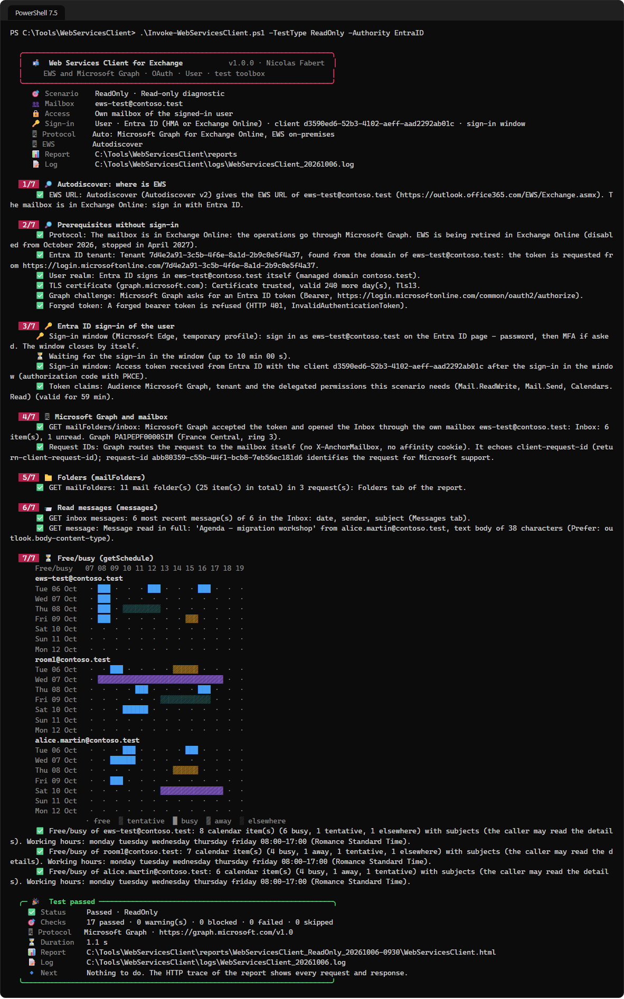
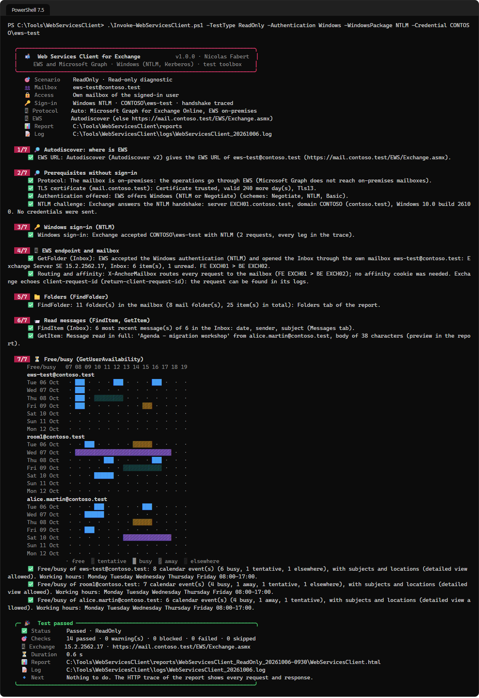
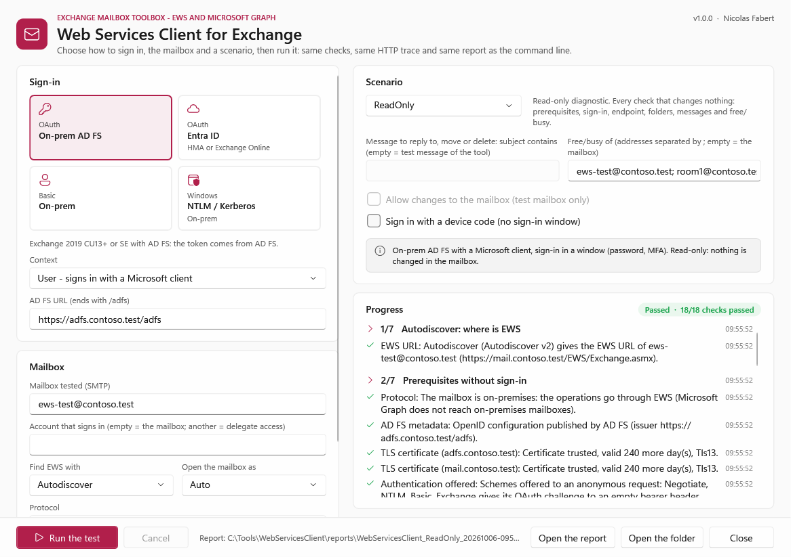
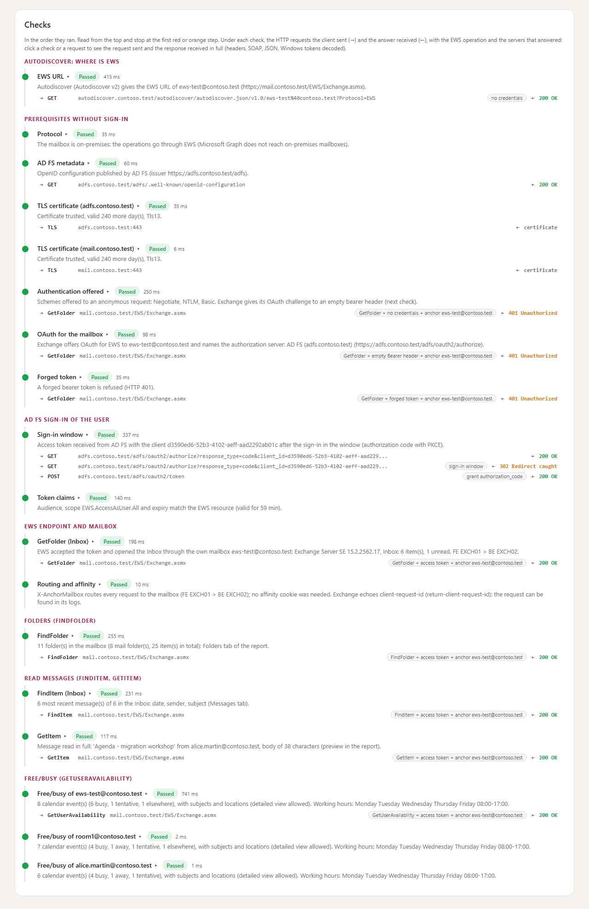
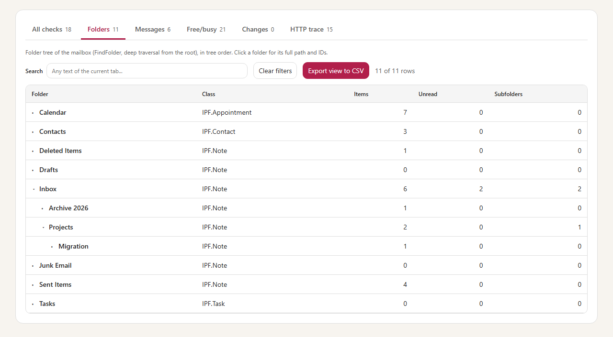
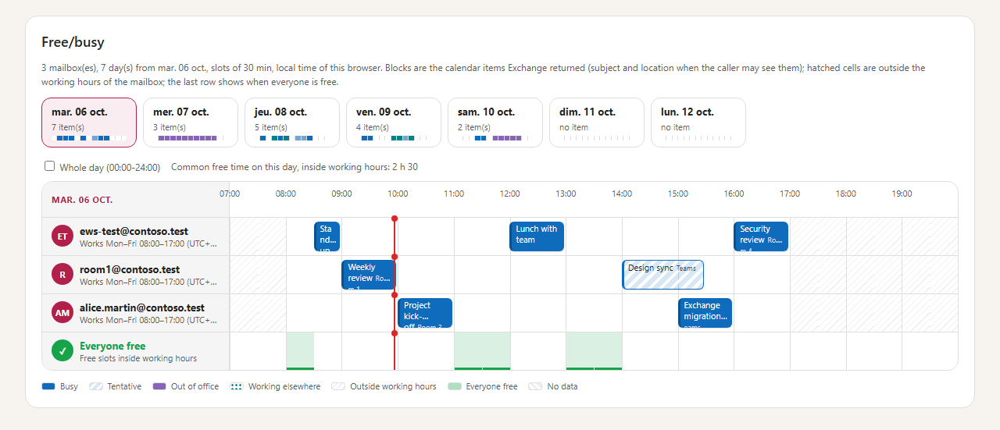
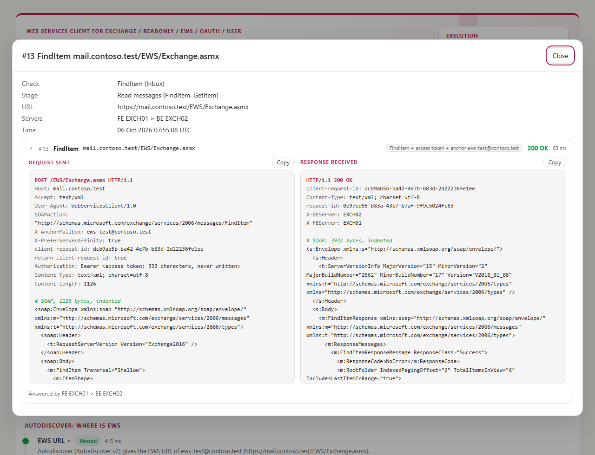
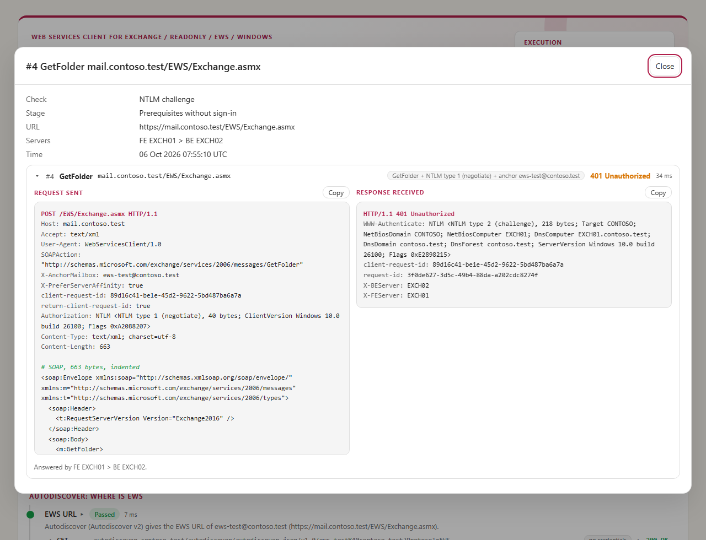

# Web Services Client for Exchange — Developer guide

> A step-by-step test toolbox for Exchange mailboxes: **EWS** on Exchange Server, **Microsoft Graph** on Exchange Online (where EWS is being retired since October 2026), with **OAuth with AD FS**, **OAuth with Entra ID** (hybrid modern authentication or Exchange Online), **Basic** and **Windows (NTLM, Kerberos)**, as a **user**, a **delegated application** or an **application**. It finds EWS like Outlook, then does what a real client does — folders, read, send, reply, move, delete, free/busy — and shows **every request sent and every response received**.

> [!IMPORTANT]
> Files downloaded from the Internet may be blocked by Windows and fail to run. Before using this project, unblock every file in the downloaded folder:
>
> ```powershell
> Get-ChildItem "C:\Chemin\Du\Dossier" -Recurse -File -Force | Unblock-File
> ```
>
> Replace the example path with the folder where you downloaded or extracted this project.

> [!NOTE]
> This is the **developer guide**: how the tool works, every sign-in method with the AD FS, Entra ID and Exchange configuration it expects, the contexts, the configuration in detail, the report and the HTTP trace, troubleshooting, the architecture and how to modify the tool. For the prerequisites and the everyday commands only, read the [user guide](WebServicesClient-UserGuide.md).

```cards
key | OAuth with AD FS | Exchange 2019 CU13+ or SE with AD FS. `-Authority ADFS` (chapter 6).
cloud | OAuth with Entra ID | Hybrid modern authentication, or Exchange Online. `-Authority EntraID` (chapter 7).
user | Basic and Windows | User name and password, or Negotiate / NTLM / Kerberos with the handshake traced leg by leg (chapter 8).
people | User, delegated app, application | `-Context User`, `Delegated` or `Application`, own mailbox, delegate access or impersonation (chapter 9).
```

## Quick start

```steps
Install | Copy the folder, unblock the files, check PowerShell 7.4 or later (chapter 11).
Configure | Replace every `contoso.test` value in `config\WebServicesClient.config.psd1` (chapter 12).
Check without signing in | `.\Invoke-WebServicesClient.ps1 -TestType Discovery`
Run the read-only test | `.\Invoke-WebServicesClient.ps1 -TestType ReadOnly` — a sign-in window opens on the AD FS or Entra ID page: type the password, then the MFA. Or `-Gui`.
Test the writes | `.\Invoke-WebServicesClient.ps1 -TestType MailCycle -AllowWrite` on a test mailbox.
Read the result | Open the HTML report named in the final card and stop at the first red or orange check (chapter 15).
```

> [!IMPORTANT]
> Use a **dedicated test mailbox** for the writing scenarios. Nothing is changed without `-AllowWrite`; reply, move and delete act only on the message named with `-ItemId` or `-ItemSubject`, or on the test message the tool sent (subject starting with `[Web Services Client for Exchange]`).

# Part I · Understand

<!-- icon: target -->
## 1. Purpose

An EWS application that fails says “401” or “cannot connect”. Its path crosses many components: Autodiscover, HTTPS publishing, the authorization server, the token (audience, permission), the authentication policy of the user, EWS access policies, the routing to the back end, the permissions on the mailbox and the throttling policy. Web Services Client for Exchange replays this path and **isolates each stage**, with the HTTP request and response of each check.

It replaces `Test-EwsOAuthFreeBusy.ps1` (one free/busy request with an AD FS device code) and keeps its first use case: `-TestType FreeBusy`.

### 1.1 EWS or Microsoft Graph

| Mailbox | Protocol with `-Protocol Auto` | Why |
|---|---|---|
| on-premises (AD FS, HMA, Basic, Windows) | EWS | Graph does not reach on-premises mailboxes |
| Exchange Online | Microsoft Graph | EWS is disabled from October 2026 and stopped in April 2027: Exchange Online answers `HTTP 403` with `X-EWS-Policy-Reason: EWS is blocked by policy for this user or tenant` |

The choice is made once the EWS URL is known (Autodiscover or configuration) and shown as the **Protocol** check. `-Protocol EWS` forces EWS (a warning for Exchange Online), `-Protocol Graph` forces Graph (OAuth with Entra ID only, no Autodiscover). The token of Graph is requested for `https://graph.microsoft.com/.default`: the permissions granted to the client.

| Operation | EWS | Microsoft Graph |
|---|---|---|
| Endpoint | `GetFolder` Inbox | `GET /users/{mailbox}/mailFolders/inbox` |
| Folders | `FindFolder` deep | `GET mailFolders` + `childFolders` (hidden folders, pages) |
| Read | `FindItem`, `GetItem` | `GET mailFolders/inbox/messages`, `GET messages/{id}` (`Prefer: outlook.body-content-type="text"`) |
| Free/busy | `GetUserAvailability` | `POST calendar/getSchedule` |
| Create a folder | `CreateFolder` | `POST mailFolders/inbox/childFolders` |
| Send / reply | `CreateItem`, `ReplyToItem` | `POST sendMail`, `POST messages/{id}/reply` |
| Move / delete | `MoveItem`, `DeleteItem` | `POST messages/{id}/move`, `DELETE`, `permanentDelete` |
| Permissions | `EWS.AccessAsUser.All`, `full_access_as_app`, impersonation | `Mail.Read` / `Mail.ReadWrite`, `Mail.Send`, `Calendars.Read` (`.Shared` for delegate access); application: the same roles, limited with RBAC for Applications |

<!-- icon: flow -->
## 2. How it works

```flow
search | Autodiscover | Where is EWS (or the URL given)
shield | Prerequisites | Certificate, authentication offered, authorization server
key | Sign-in | OAuth, Basic or Windows; token claims
server | Endpoint | Version, servers, routing, affinity
mail | Operations | Folders, messages, free/busy, writes
chart | Report | Steps, data and HTTP trace
```

A stage runs only if no earlier stage failed or was blocked; the next ones are *Skipped*. The same engine runs the command line and the window.

<!-- icon: layers -->
## 3. Scenarios

| Scenario | Stages (after Autodiscover) | Changes the mailbox |
|---|---|---|
| `Discovery` | prerequisites, no sign-in | no |
| `SignIn` | sign-in and token, or the Basic or Windows sign-in | no |
| `Endpoint` | + `GetFolder` on the Inbox | no |
| `Folders` | + `FindFolder` deep | no |
| `ReadMail` | + `FindItem` (latest *Test.MessageCount* messages) and `GetItem` (one in full) | no |
| `FreeBusy` | + `GetUserAvailability` for `-FreeBusyMailboxes` | no |
| `CreateFolder` | + the test folder under the Inbox | yes |
| `SendMail` | + a test message, then its delivery to the Inbox | yes |
| `ReplyMail` | + `ReplyToItem` on the chosen message | yes |
| `MoveMail` | + `MoveItem` to the test folder | yes |
| `DeleteMail` | + `DeleteItem` (*Test.DeleteMode*) | yes |
| `ReadOnly` | Discovery, sign-in, endpoint, folders, messages, free/busy | no |
| `MailCycle` | sign-in, endpoint, create, send, reply, move, delete | yes |
| `Full` | ReadOnly, then MailCycle | yes |
| `SeedData` | creates test data so that a read-only run shows something: folders `Projects`, `Projects\Migration`, `Archive 2026`, six messages, seven calendar items over the week (busy, tentative, away, elsewhere); all subjects start with `[Test data]`, nothing is created twice | yes |
| `CleanData` | removes what `SeedData` created (and only that: `[Test data]` subjects, its folders) | yes |

With `Target.Discovery Autodiscover` (default) every scenario starts with the **Autodiscover** stage; with `Manual` it uses `Target.EwsUrl`.

<!-- icon: check -->
## 4. Results

| Status | Meaning |
|---|---|
| **Passed** | The check works. |
| **Warning** | It works, with something to look at (the message says what). |
| **Blocked** | A writing step without `-AllowWrite`. |
| **Failed** | It does not work: the message gives the cause and what to check. |
| **Skipped** | Not run because an earlier step failed or was blocked. |

Exit code: `0` passed, `1` failed, `2` warnings or blocked.

# Part II · Ways to sign in

<!-- icon: compare -->
## 5. Choose the path

| | AD FS | Entra ID | Basic | Windows |
|---|---|---|---|---|
| Exchange | 2019 CU13+ / SE | on-prem with HMA, Exchange Online | on-prem | on-prem |
| Switch | `-Authority ADFS` | `-Authority EntraID` | `-Authentication Basic` | `-Authentication Windows` |
| Credentials | sign-in window or device code; client secret (application) | window or device code; certificate or secret (application) | user name and password | current account or `-Credential` |
| Traced | token request, claims | token request, claims | user name only | every leg, tokens decoded |

`-Authority Auto` signs in where Exchange sends the mailbox (the `authorization_uri` of its challenge).

The **sign-in window** is Microsoft Edge or Google Chrome with a temporary profile; the tool catches the redirect that carries the authorization code (PKCE) and deletes the profile. Without a desktop or a browser, or with `-SignIn DeviceCode`, a code is typed on any device.

<!-- icon: key -->
## 6. OAuth with AD FS

### 6.1 What must be in place

- Exchange Server 2019 CU13+ or SE with OAuth through AD FS (`New-AuthServer -Type ADFS`, `Set-OrganizationConfig -OAuth2ClientProfileEnabled $true`), OAuth on the EWS virtual directory.
- In AD FS, the Exchange application group: the Web API identifier `https://<EWS host>/`, the native client `d3590ed6-52b3-4102-aeff-aad2292ab01c` with the redirect URI `urn:ietf:wg:oauth:2.0:oob`, the scope `EWS.AccessAsUser.All`.
- For the **Delegated** context: your native client, permitted on the Exchange application (`Grant-AdfsApplicationPermission`), with its redirect URI (`-RedirectUri`). For the **Application** context: a server application with a secret, permitted on the Exchange relying party. Exchange Server documents application access with Entra ID; an AD FS application token may be refused (`401` with `x-ms-diagnostics`): the test shows it.

### 6.2 Run it

```powershell
.\Invoke-WebServicesClient.ps1 -TestType ReadOnly -Authority ADFS -AdfsUrl https://adfs.contoso.com/adfs -Mailbox ews-test@contoso.com
```

### 6.3 Checks specific to AD FS

*AD FS metadata* (OpenID configuration, certificate of AD FS), the redirect URI of the window accepted for the client before the window opens (`MSIS9224` otherwise), the token claims (audience `https://<EWS host>/`, scope `EWS.AccessAsUser.All`).

<!-- icon: cloud -->
## 7. OAuth with Entra ID — HMA or Exchange Online

### 7.1 What must be in place

- **HMA**: the Hybrid Configuration Wizard, the EWS URLs among the service principal names of *Office 365 Exchange Online* (`00000002-0000-0ff1-ce00-000000000000`), `Get-AuthServer` EvoSts as default authorization endpoint.
- **Exchange Online**: nothing on Exchange. `EwsEnabled` must not be `$false` (organisation, mailbox).
- **Delegated**: an app registration with the delegated permission *EWS.AccessAsUser.All* of Office 365 Exchange Online, a redirect URI (*Mobile and desktop*: `https://login.microsoftonline.com/common/oauth2/nativeclient` by default), *Allow public client flows* for the device code.
- **Application**: the application permission *full_access_as_app* with admin consent, a certificate (recommended, `-CertificateThumbprint`, private key in `Cert:\CurrentUser\My` or `Cert:\LocalMachine\My`) or a client secret. Limit the mailboxes with an application access policy or RBAC for Applications.

### 7.2 Run it

```powershell
# User, hybrid or Exchange Online (Autodiscover decides)
.\Invoke-WebServicesClient.ps1 -TestType ReadOnly -Authority EntraID -Mailbox ews-test@contoso.com
# Application with a certificate, impersonating the mailbox
.\Invoke-WebServicesClient.ps1 -TestType ReadMail -Authority EntraID -Context Application -AppClientId <id> -CertificateThumbprint <thumbprint> -Mailbox ews-test@contoso.com
# Your application on behalf of Alice, who opens a shared mailbox
.\Invoke-WebServicesClient.ps1 -TestType Folders -Authority EntraID -Context Delegated -AppClientId <id> -SignInUser alice@contoso.com -Mailbox shared@contoso.com
```



### 7.3 Checks specific to Entra ID

*Entra ID tenant* (from `-TenantId`, the authorization URL of Exchange or the domain), *User realm* (managed or federated), *Tenant trusted by Exchange* (`trusted_issuers`: the tenant ID on-premises, `@*` in Exchange Online), token claims (`tid`, audience, `scp` or `roles`). Common `AADSTS` errors are explained (500011 URL not registered, 65001 / 90094 consent, 53003 Conditional Access, 7000215 client secret, 700027 certificate).

<!-- icon: user -->
## 8. Basic and Windows authentication

### 8.1 Basic

On-premises only (Exchange Online refuses it, and the tool does not send the password there). One `GetServerTimeZones` request checks the user name and password; the run stops at the first refusal so that a wrong password is sent once. *Discovery* checks that Basic is offered and that a user that does not exist is refused.

### 8.2 Windows: Negotiate, NTLM, Kerberos

The handshake is done by the tool with `System.Net.Security.NegotiateAuthentication` (SSPI): each leg is a request of the trace, with the token decoded.

```cards
server | NTLM | Request + type 1 → `401` + type 2 (the server, its NetBIOS and DNS domain, its version) → request + type 3 (user, domain, workstation) → `200`.
key | Kerberos | Request + service ticket for `HTTP/<host>` → `200`, with the mutual authentication token.
compare | Negotiate | Kerberos when a KDC of the realm answers and knows the SPN, NTLM otherwise, like Windows.
shield | Never written | The response to the NTLM challenge and the Kerberos ticket: only their length.
```

**From a computer outside the domain**: NTLM works with `-Credential DOMAIN\user`. Kerberos needs, from that computer, a domain controller of the realm (DNS `_kerberos._tcp.<domain>`, TCP 88 — a VPN for instance) and the SPN of the EWS host name (`setspn`, alternate service account for a load-balanced name). *Discovery* sends an NTLM negotiate message **without credentials**: the challenge names the AD domain, used to check the Kerberos realm.



The legs of NTLM must share one TCP connection: the HTTP client of a Windows run keeps one connection per server. Once authenticated, the next requests go on that connection without a token (*Windows session of the connection* in the trace); a `401` starts a new handshake.

> [!NOTE]
> **Extended Protection**: like Windows and Outlook, every handshake carries the **channel binding token** of the TLS connection (`tls-server-end-point`, RFC 5929: the hash of the certificate the server presented), shown in the trace with the SPN. Exchange then accepts it with Extended Protection set to *Require*, and also **behind a reverse proxy that terminates TLS** (IIS ARR, a load balancer): the binding is computed on the certificate this client sees. Without it, the domain controller refuses the logon (event 4625, status `0xC000035B`) and Exchange answers `401` after the type 3.

<!-- icon: people -->
## 9. Contexts and access to the mailbox

| Context | Who acts | Token | Typical use |
|---|---|---|---|
| `User` | the user, with a Microsoft client | delegated, `EWS.AccessAsUser.All` | a user, Outlook-like |
| `Delegated` | your application on behalf of the user | delegated, issued to your client ID | a line-of-business app with a user |
| `Application` | your application alone | application, `full_access_as_app` | a service, a migration or archiving tool |

| Access (`-Access`) | How | Needs |
|---|---|---|
| `Self` | the own mailbox of the signed-in account | — |
| `Delegate` | `<t:Mailbox>` in the folder IDs; sending From the mailbox | Full Access or folder permissions; Send As / Send on Behalf |
| `Impersonation` | `ExchangeImpersonation` header | ApplicationImpersonation role (on-premises); application token (Exchange Online) |

`Auto` (default): `Impersonation` for an application, `Delegate` when `-SignInUser` is another account, `Self` otherwise.

# Part III · Set up

<!-- icon: checklist -->
## 10. Prerequisites

- PowerShell 7.4 or later (7.5+ for the Fluent theme of the window), Windows 10/11 or Windows Server 2016 to 2025.
- HTTPS access to EWS, Autodiscover and the authorization server; Microsoft Edge or Google Chrome for the sign-in window.
- A test mailbox; for the writing scenarios, the right to send to itself.

<!-- icon: download -->
## 11. Installation

Copy the folder, then unblock the files: `Get-ChildItem <folder> -Recurse -File | Unblock-File`. Nothing else to install.

<!-- icon: settings -->
## 12. Configuration

`config\WebServicesClient.config.psd1`, checked at start (every problem listed at once). The command-line parameters override it.

| Section | Keys |
|---|---|
| `Target` | `Mailbox`, `SignInUser`, `Discovery` (Autodiscover, Manual), `EwsUrl`, `AdfsUrl`, `Authority` (ADFS, EntraID, Auto), `TenantId` |
| `Identity` | `Authentication` (OAuth, Basic, Windows), `Context` (User, Delegated, Application), `ClientId`, `AppClientId`, `RedirectUri`, `CertificateThumbprint`, `WindowsPackage`, `Access` |
| `Ews` | `RequestServerVersion`, `UserAgent`, `PreferServerAffinity`, `MaxRetries` |
| `Test` | `DefaultType`, `SignIn`, `AllowWrite`, `MessageCount`, `FolderName`, `Recipient`, `DeleteMode`, `DeliveryWaitSeconds`, `FreeBusyMailboxes`, `FreeBusyDays`, `FreeBusyIntervalMinutes`, timeouts, `CertificateWarningDays` |
| `Report`, `Logging` | output folder, prefix, formats, CSV delimiter; log folder and retention |

No secret in the file: passwords (`-Credential`) and client secrets (`-ClientSecret`, or asked) stay in memory.

# Part IV · Use

<!-- icon: terminal -->
## 13. Command line

```powershell
.\Invoke-WebServicesClient.ps1 -TestType <scenario> [-Mailbox <smtp>] [-SignInUser <upn>]
    [-Discovery Autodiscover|Manual] [-EwsUrl <url>]
    [-Authentication OAuth|Basic|Windows] [-Authority ADFS|EntraID|Auto] [-AdfsUrl <url>] [-TenantId <id>]
    [-Context User|Delegated|Application] [-AppClientId <id>] [-CertificateThumbprint <tp>] [-ClientSecret <securestring>]
    [-Access Auto|Self|Delegate|Impersonation] [-WindowsPackage Negotiate|NTLM|Kerberos] [-Credential <pscredential>]
    [-AllowWrite] [-ItemId <id>] [-ItemSubject <text>] [-FreeBusyMailboxes <list>] [-FreeBusyDays <n>] [-Recipient <smtp>]
    [-SignIn Auto|Window|DeviceCode] [-OutputPath <folder>] [-NoReport] [-Gui]
```

`Get-Help .\Invoke-WebServicesClient.ps1 -Full` lists every parameter with examples. Giving `-Mailbox` without `-EwsUrl` lets Autodiscover find the URL of that mailbox.

<!-- icon: layers -->
## 14. Window



`-Gui` opens the window: four sign-in cards (AD FS, Entra ID, Basic, Windows), the context and the application fields, the mailbox and the access, the scenario with its options (message to work on, free/busy mailboxes, *Allow changes*, device code), the progress live, *Open the report*. Same engine and same report as the command line.

<!-- icon: chart -->
## 15. Reading the report

The HTML report has: the result and the counts; **Scope** (mailbox, who signed in, authorization server, token permission, EWS URL and where it came from, Exchange version, servers and affinity, request headers); **Checks** in order, with under each one the requests it sent — operation, URL, what was sent (token, NTLM type, anchor, impersonation, affinity cookie), status; the tabs *Folders*, *Messages*, *Free/busy*, *Changes* and *HTTP trace*.





### 15.1 The free/busy view

*FreeBusy* (and *ReadOnly*, *Full*) adds a **Free/busy** block to the report, like the scheduling assistant of Outlook: one button per day (with a small map of the day: busy, tentative, away, elsewhere), then one row per mailbox from 07:00 to 20:00 (*Whole day* for 00:00-24:00) with the calendar items Exchange returned — busy in blue, tentative hatched, out of office in purple, working elsewhere dotted, with the subject and the location when the caller may see them (tooltip: times, status). Cells outside the working hours of the mailbox are hatched, a red line marks the current time, and the last row **Everyone free** shows the slots free for every mailbox inside their working hours, with the total for the day. A mailbox without free/busy (unknown address, cross-premises free/busy not configured) shows the error on its row. The same data are in FreeBusy.csv.



The console shows a compact map per mailbox and day, one cell per hour (· free, ▒ tentative, █ busy, ▓ away, ░ elsewhere; . ~ # O w with WSC_ICONS=Ascii).

### 15.2 The HTTP trace

Click a request: the request sent and the response received side by side, headers and body (SOAP indented). What to look at:





| Header or element | Meaning |
|---|---|
| `X-AnchorMailbox` | the mailbox the request routes to |
| `X-FEServer`, `X-BEServer`, `X-CalculatedBETarget` | the front-end and back-end servers |
| `Set-Cookie: X-BackEndOverrideCookie` | affinity to a back end, sent back with the next requests |
| `client-request-id`, `request-id` | to find the request in the logs of Exchange (EWS logs, HttpProxy) |
| `WWW-Authenticate` | schemes offered; `Bearer authorization_uri`, `trusted_issuers`; NTLM challenge decoded |
| `x-ms-diagnostics` | the reason of an OAuth refusal |
| `ServerVersionInfo` | the build of the mailbox server |
| `ResponseCode`, SOAP fault | the EWS answer of the operation (`NoError`, `ErrorAccessDenied`...) |

<!-- icon: folder -->
## 16. Files produced

One folder per run under `reports\`: `Steps.csv`, `Folders.csv`, `Messages.csv`, `FreeBusy.csv`, `Actions.csv`, `Trace.csv`, `Summary.json`, the HTML report; a daily log in `logs\`. They contain mailbox data (folder names, subjects, senders, a body preview, free/busy): protect them.

# Part V · Maintain

<!-- icon: gear -->
## 17. Architecture

| File | Role |
|---|---|
| `Invoke-WebServicesClient.ps1` | command line: configuration, secrets asked, run, report, exit code |
| `src\…Console.ps1` · `Config.ps1` | console, log; configuration, scenarios, endpoints |
| `src\…Http.ps1` | the only network call (`Send-WscHttpRequest`) and the trace |
| `src\…Windows.ps1` | Negotiate / NTLM / Kerberos handshake and token decoding |
| `src\…Ews.ps1` | SOAP envelopes, headers, answers, throttling, operations |
| `src\…OAuth.ps1` · `Checks.ps1` | OAuth building blocks shared with EAS OAuth Mailbox; steps, sign-in window, application sign-in, token claims |
| `src\…Discovery.ps1` | Autodiscover and prerequisites |
| `src\…Run.ps1` · `Operations.ps1` | protocol choice, sign-in stage and `Invoke-WscMailboxTest`; the EWS operations, folder tree (`Set-WscFolderPaths`: folder IDs are case-sensitive, indexed with an ordinal dictionary) |
| `src\…Graph.ps1` · `Seed.ps1` | the Microsoft Graph operations (Exchange Online); the test data of `SeedData` / `CleanData`, EWS and Graph |
| `src\…Browser.ps1` · `Report.ps1` · `Gui.ps1` | sign-in window; CSV, JSON, HTML; WPF window |

<!-- icon: beaker -->
## 18. Tests

`.\Run-Tests.ps1` runs the Pester tests against `tests\WebServicesClient.Simulator.ps1`: Autodiscover v2 and POX, AD FS and Entra ID, EWS and Microsoft Graph operations, NTLM challenge built byte by byte, channel binding, throttling, impersonation and delegate refusals, free/busy and working hours, test data, report, window.

The repository tools (not in the package):

```powershell
.\tools\New-DocumentationImages.ps1         # screenshots of the guides, rendered by the tool itself against the simulated Exchange
.\tools\Build-Documentation.ps1             # the HTML guides (user guide, developer guide)
.\tools\New-ReadmeImages.ps1                # the graphics of the README (light and dark)
.\tools\New-WebServicesClientPackage.ps1    # the release folder: run-time files and the HTML guides only
```

<!-- icon: wrench -->
## 19. Evolving the tool

A new operation: a SOAP body in `Ews.ps1`, a stage in `Operations.ps1`, its entry in `$script:StageInfo` and in a scenario (`Config.ps1`), its title in the template, a simulated answer and a test.

# Appendices

<!-- icon: lifebuoy -->
## Appendix A - Troubleshooting

| Symptom | Cause and what to check |
|---|---|
| *No usable Autodiscover answer* | `autodiscover.<domain>` not published, or answering only POX with credentials: publish it, or `-Discovery Manual -EwsUrl`. |
| *TLS handshake interrupted* | a firewall, NSG, reverse proxy or VPN / Global Secure Access client on the path, not the certificate. |
| `401` with OAuth | audience (the EWS host), scope or role, OAuth on the EWS virtual directory, `BlockModernAuthWebServices`, `EwsEnabled`; read `x-ms-diagnostics`. |
| `403` | `EwsEnabled`, `EwsAllowList` / `EwsApplicationAccessPolicy`, application access policy. |
| `ErrorImpersonateUserDenied` | ApplicationImpersonation role (on-premises), `full_access_as_app` and application access policy (Exchange Online). |
| `ErrorAccessDenied` | delegate access: Full Access or folder permissions of the signing-in account. |
| `ErrorSendAsDenied` | Send As / Send on Behalf on the mailbox. |
| `HTTP 403` + `X-EWS-Policy-Reason` (Exchange Online) | EWS is retired there: use `-Protocol Auto` (Graph). Until April 2027 an administrator can still allow it (`Set-OrganizationConfig -EwsEnabled $true`, the client ID in `EwsAllowedAppIDs`). |
| Graph `403 ErrorAccessDenied` | the permission is missing from the token (the *Token claims* check names it), admin consent, RBAC for Applications. |
| Graph `404 MailboxNotEnabledForRESTAPI` | the mailbox is on-premises: Graph cannot reach it, use `-Protocol EWS`. |
| `ErrorServerBusy` | EWS throttling: the tool waits *BackOffMilliseconds* and tries again (`Ews.MaxRetries`). |
| Free/busy `ErrorFreeBusyGenerationFailed`, `ErrorProxyRequestProcessingFailed` | cross-premises or cross-organisation free/busy: organisation relationship, OAuth between on-premises and Exchange Online, availability address space. |
| Windows `401` after type 3 | wrong password, Windows authentication disabled on EWS, a reverse proxy that does not relay NTLM; event 4625 on the domain controller gives the reason (`0xC000035B`: channel binding refused). |
| Negotiate chose NTLM | no Kerberos ticket from here: KDC out of reach, SPN not registered, computer out of the domain. |

<!-- icon: info -->
## Appendix B - EWS response codes

`NoError` success · `ErrorAccessDenied` permission · `ErrorImpersonateUserDenied` impersonation · `ErrorNonExistentMailbox` address · `ErrorItemNotFound` item ID · `ErrorServerBusy` throttling · `ErrorInvalidServerVersion` *RequestServerVersion* · `ErrorMailRecipientNotFound` free/busy address · `ErrorQuotaExceeded` mailbox full.

<!-- icon: shield -->
## Appendix C - Security and data

Tokens, client secrets and passwords are never written. The trace masks tokens, codes, secrets and cookies (except the affinity cookies of Exchange), shows only the user name of Basic and the user/domain/workstation of NTLM. Reports contain mailbox data: keep them as such.

<!-- icon: tag -->
## Appendix D - Versions

MAJOR.MINOR.PATCH: MAJOR for an incompatible change of the configuration or the result, MINOR for a feature, PATCH for a fix. See `CHANGELOG.md`.
