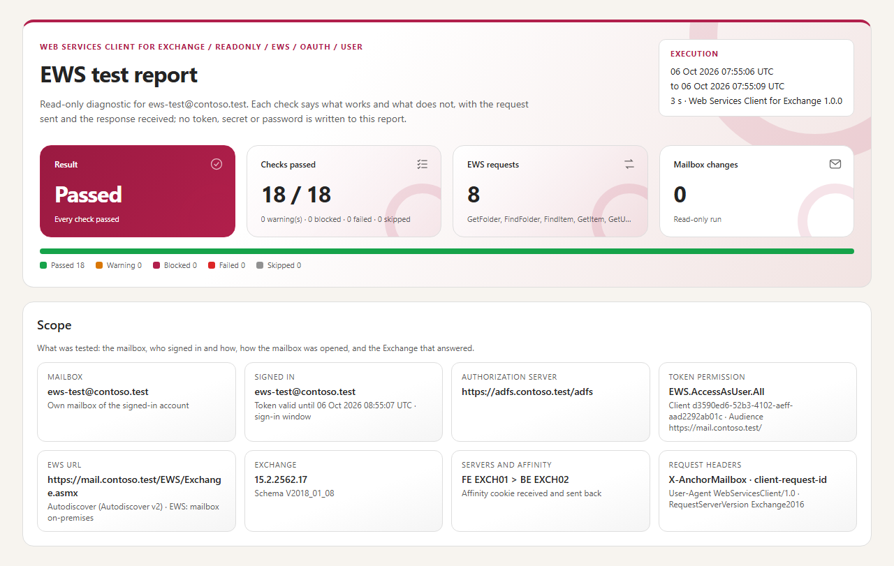

# Web Services Client for Exchange — User guide

> What you need before the first test, then one command per everyday question: **does EWS answer?**, **why can this user not open the mailbox?**, **does this application have access?**, **when are these people free?**, **can a client send, reply, move and delete?** How the tool works, every sign-in method with its configuration, the report in detail and the internals are in the [developer guide](WebServicesClient-Guide.md).

> [!IMPORTANT]
> Files downloaded from the Internet may be blocked by Windows and fail to run. Before using this project, unblock every file in the downloaded folder:
>
> ```powershell
> Get-ChildItem "C:\Chemin\Du\Dossier" -Recurse -File -Force | Unblock-File
> ```
>
> Replace the example path with the folder where you downloaded or extracted this project.

```cards
checklist | Prerequisites | Chapter 1: the workstation, the browser, the network, a test mailbox, what Exchange needs for each sign-in method, then the one-time setup.
terminal | Everyday use | Chapter 2: one command per question, with the part of the report that answers it.
compare | Which scenario? | Chapter 3: from no sign-in at all to the full mail cycle.
file | Results | Chapter 4: the console, the report, the files and the exit codes.
```

<!-- icon: checklist -->
## 1. Prerequisites

| Item | Requirement |
|---|---|
| Workstation | Windows 10 / 11 or Windows Server 2016 to 2025, **PowerShell 7.4** or later (7.5 or later for the Windows 11 look of the window). Nothing to install. It does not have to be in the domain. |
| Browser | Microsoft Edge or Google Chrome, for the OAuth sign-in window. Without one, a device code is shown instead. |
| Network | HTTPS to EWS (or `graph.microsoft.com` for Exchange Online), to Autodiscover, and to AD FS or `login.microsoftonline.com`. |
| Account | A **test mailbox** and its password (and its MFA). The scenarios that write — send, reply, move, delete, test data — must only be used on it. |

And on the Exchange side, for the sign-in method you test:

| Sign-in method | Exchange side |
|---|---|
| **OAuth - AD FS** | Exchange Server 2019 CU13+ or SE configured for modern authentication with AD FS, OAuth on the EWS virtual directory, and an authentication policy that allows it for the user |
| **OAuth - Entra ID** | Exchange on-premises in hybrid with modern authentication (HMA), or a mailbox in **Exchange Online** — reached through Microsoft Graph, EWS being retired there |
| **Basic** | Basic authentication allowed on the EWS virtual directory (on-premises only) |
| **Windows** | Windows authentication on the EWS virtual directory. Out of the domain, NTLM with `-Credential DOMAIN\user`; Kerberos needs a domain controller in reach |

An **application** (client credentials) needs its app registration and the consent of an administrator: [developer guide, chapters 6, 7 and 9](WebServicesClient-Guide.md#9-contexts-and-access-to-the-mailbox).

### 1.1 One-time setup

```steps
Copy the tool | Download `WebServicesClient-<version>.zip` from the latest release, extract it (for example in `C:\Tools`) and unblock the files. No installer.
Name your organisation | `notepad .\config\WebServicesClient.config.psd1`: replace the `contoso.test` values — the test mailbox, the EWS URL and, with AD FS, the AD FS URL. Every value can also be given on the command line or typed in the window.
Check without signing in | `.\Invoke-WebServicesClient.ps1 -TestType Discovery` finds EWS and says which sign-in Exchange offers this mailbox.
First real test | `.\Invoke-WebServicesClient.ps1 -TestType ReadOnly`: a sign-in window opens on the AD FS or Entra ID page — type the password, then the MFA. Nothing is changed in the mailbox.
```

<!-- icon: terminal -->
## 2. Everyday use

Every command below writes a report: open it and **stop at the first red or orange check** — it says what failed and what to look at, with the request sent and the response received. What is not given on the command line comes from the configuration file.

### 2.1 Does EWS answer?

Before opening EWS to users or to an application, or when nothing works at all: no sign-in, nothing is changed.

```powershell
# Autodiscover, certificates, authentication offered, OAuth for this mailbox, a forged token refused
.\Invoke-WebServicesClient.ps1 -TestType Discovery -Mailbox ews-test@contoso.com

# The EWS URL is known: skip Autodiscover
.\Invoke-WebServicesClient.ps1 -TestType Discovery -Discovery Manual -EwsUrl https://mail.contoso.com/EWS/Exchange.asmx
```

Look at *OAuth for the mailbox*: it names the sign-in server Exchange gives this user (AD FS or Entra ID), or says that the authentication policy of the user blocks modern authentication.

### 2.2 A user cannot open the mailbox

Replay the client with the sign-in method of the user. *ReadOnly* signs in, opens the Inbox, lists the folders, reads the latest messages and the free/busy — and changes nothing.

```powershell
.\Invoke-WebServicesClient.ps1 -TestType ReadOnly -Mailbox alice@contoso.com                          # OAuth with AD FS
.\Invoke-WebServicesClient.ps1 -TestType ReadOnly -Mailbox alice@contoso.com -Authority EntraID       # OAuth with Entra ID (HMA)
.\Invoke-WebServicesClient.ps1 -TestType ReadOnly -Mailbox alice@contoso.com -Authority Auto          # where Exchange sends the user
.\Invoke-WebServicesClient.ps1 -TestType ReadOnly -Mailbox alice@contoso.com -Authentication Basic    # the password is asked
.\Invoke-WebServicesClient.ps1 -TestType ReadOnly -Authentication Windows -WindowsPackage NTLM -Credential CONTOSO\alice
```

Where it stops tells the story: at the sign-in (AD FS, Entra ID, password), at the *Token claims* (audience or permission), at *GetFolder* (Exchange refused the token or the account), or later (permissions, throttling).


> [!TIP]
> On a server without a browser, add `-SignIn DeviceCode`: type the code on any other device (a private window if that browser is already signed in with another account).

### 2.3 A mailbox in Exchange Online

The same commands with `-Authority EntraID`. The tool chooses **Microsoft Graph** by itself when Autodiscover says the mailbox is in Exchange Online: EWS is being retired there (refused with `HTTP 403` and `X-EWS-Policy-Reason`).

```powershell
.\Invoke-WebServicesClient.ps1 -TestType ReadOnly -Authority EntraID -Mailbox alice@contoso.com
.\Invoke-WebServicesClient.ps1 -TestType ReadOnly -Authority EntraID -Mailbox alice@contoso.com -Protocol EWS   # check that EWS is really refused
```

The *Protocol* check says which protocol was used and why.

### 2.4 An application

```powershell
# The application in its own context (certificate in Cert:\CurrentUser\My), on one mailbox
.\Invoke-WebServicesClient.ps1 -TestType ReadMail -Authority EntraID -Context Application -AppClientId <client ID> -CertificateThumbprint <thumbprint> -Mailbox shared@contoso.com

# The application on behalf of a user (delegated), who opens a shared mailbox
.\Invoke-WebServicesClient.ps1 -TestType Folders -Authority EntraID -Context Delegated -AppClientId <client ID> -SignInUser alice@contoso.com -Mailbox shared@contoso.com
```

*Token claims* lists the permissions in the token and names the one the scenario lacks; *GetFolder* shows how the mailbox was opened (own mailbox, delegate access or impersonation).

### 2.5 When are these people free?

```powershell
.\Invoke-WebServicesClient.ps1 -TestType FreeBusy -FreeBusyMailboxes alice@contoso.com,bob@contoso.com,room1@contoso.com
.\Invoke-WebServicesClient.ps1 -TestType FreeBusy -FreeBusyMailboxes alice@contoso.com -FreeBusyDays 14
```

The report shows a view like the scheduling assistant of Outlook: one button per day, one row per mailbox with the calendar items (busy, tentative, out of office, working elsewhere), the working hours of each mailbox, and an **Everyone free** row. A mailbox without free/busy (unknown address, cross-premises free/busy not configured) shows the error on its row.


### 2.6 Can a client send, reply, move and delete?

On a **test mailbox** only: the writes need `-AllowWrite`.

```powershell
# The whole cycle: test folder, send to itself, reply, move, delete
.\Invoke-WebServicesClient.ps1 -TestType MailCycle -AllowWrite

# One operation on one message: its subject (or its ID, from the Messages tab of a ReadOnly report)
.\Invoke-WebServicesClient.ps1 -TestType ReplyMail -AllowWrite -ItemSubject 'Agenda - migration workshop'
.\Invoke-WebServicesClient.ps1 -TestType SendMail -AllowWrite -Recipient bob@contoso.com
```

Reply, move and delete act only on the message given with `-ItemSubject` or `-ItemId`, or on the test message the tool sent. The *Changes* tab of the report lists everything the run changed.

### 2.7 A test mailbox that shows something

A new test mailbox is empty: *ReadOnly* then has little to show. *SeedData* creates folders, six messages and seven calendar items over the week (busy, tentative, out of office, working elsewhere), all named `[Test data]`; *CleanData* removes them, and only them.

```powershell
.\Invoke-WebServicesClient.ps1 -TestType SeedData -AllowWrite
.\Invoke-WebServicesClient.ps1 -TestType CleanData -AllowWrite
```

### 2.8 The window

```powershell
.\Invoke-WebServicesClient.ps1 -Gui
```

Choose the sign-in method, check the mailbox, choose the scenario and its options, then **Run the test**. Same checks, same report as the command line.


<!-- icon: compare -->
## 3. Which scenario?

| You want to... | Scenario | Changes the mailbox |
|---|---|---|
| check the prerequisites, or understand why nothing works | `Discovery` | no |
| know whether the sign-in works and the token is right | `SignIn`, `Endpoint` | no |
| see what a client sees: folders, messages, free/busy | `ReadOnly` (or `Folders`, `ReadMail`, `FreeBusy` alone) | no |
| check sending, replying, moving and deleting | `MailCycle` (or `CreateFolder`, `SendMail`, `ReplyMail`, `MoveMail`, `DeleteMail` alone) | yes |
| accept a mailbox or an application from end to end | `Full` (ReadOnly then MailCycle) | yes |
| fill or empty a test mailbox | `SeedData`, `CleanData` | yes |

The options you will use most:

| Option | Use |
|---|---|
| `-Mailbox` | the mailbox tested; without `-EwsUrl`, Autodiscover finds its EWS URL |
| `-Discovery Manual -EwsUrl <url>` | skip Autodiscover |
| `-Authentication OAuth\|Basic\|Windows` · `-Authority ADFS\|EntraID\|Auto` | the sign-in method |
| `-Context User\|Delegated\|Application` · `-AppClientId` | who acts: the user, your application on behalf of the user, your application alone |
| `-SignInUser` | another account signs in: delegate access to `-Mailbox` |
| `-Protocol Auto\|EWS\|Graph` | `Auto`: Microsoft Graph for Exchange Online, EWS on-premises |
| `-AllowWrite` | allow the scenarios that change the mailbox |
| `-SignIn DeviceCode` | no sign-in window: a code to type on another device |

`Get-Help .\Invoke-WebServicesClient.ps1 -Full` lists every parameter with examples.

<!-- icon: file -->
## 4. Results

- The **console** shows each check as it runs, then a final card: the verdict, the first issue, the path of the report and what to do next.
- The **report** is `reports\WebServicesClient_<scenario>_<date>\WebServicesClient.html`, a single file: the result, what was tested (mailbox, sign-in, EWS URL, Exchange servers), the checks in order with the requests under each one, then the free/busy view and the tabs *Folders*, *Messages*, *Free/busy*, *Changes* and *HTTP trace*. Click a check or a request: the request sent and the response received in full.
- Next to it, the same data as CSV (`Steps`, `Folders`, `Messages`, `FreeBusy`, `Actions`, `Trace`) and `Summary.json`; a daily log in `logs\`.
- **Exit code**: `0` passed, `1` failed, `2` warnings or blocked (a write without `-AllowWrite`).



> [!WARNING]
> The reports contain mailbox data — folder names, subjects, senders, a body preview, free/busy. Keep them like the mailbox itself. Passwords, tokens and client secrets are never written.
